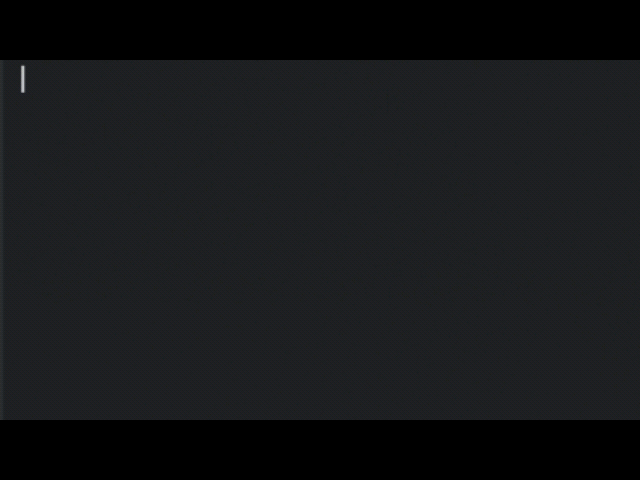
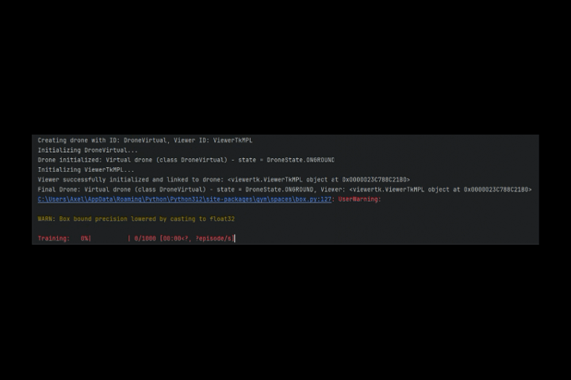
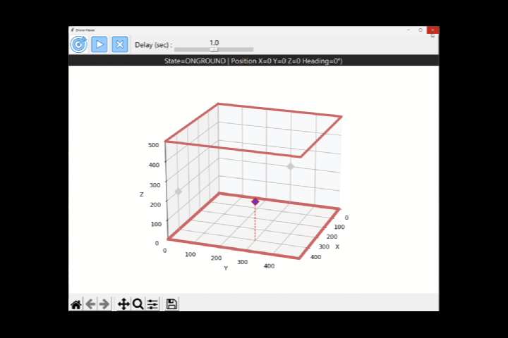
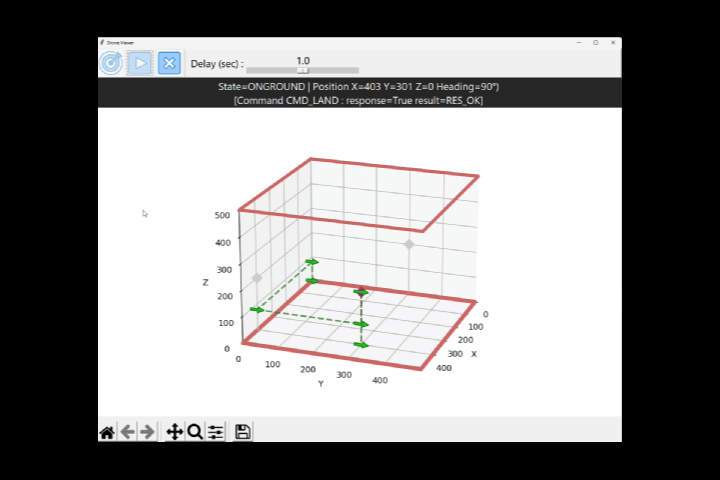
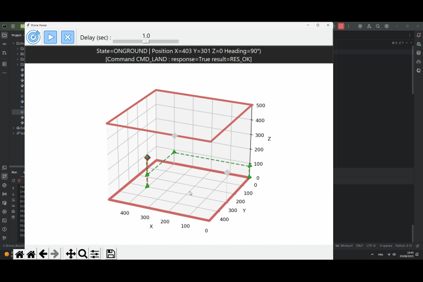
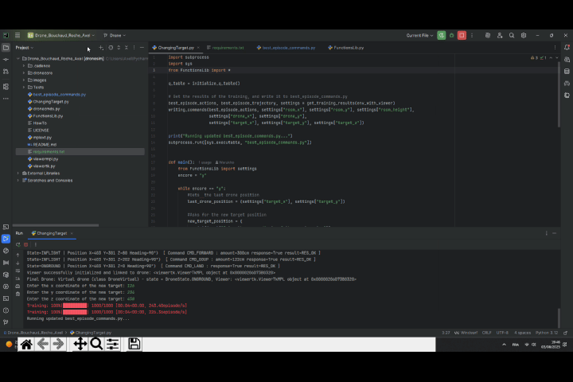
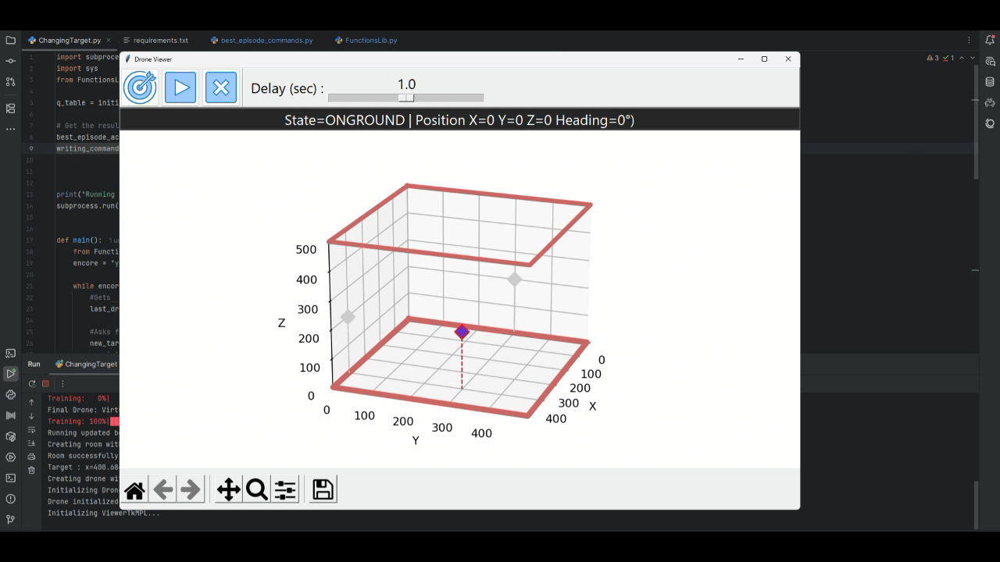
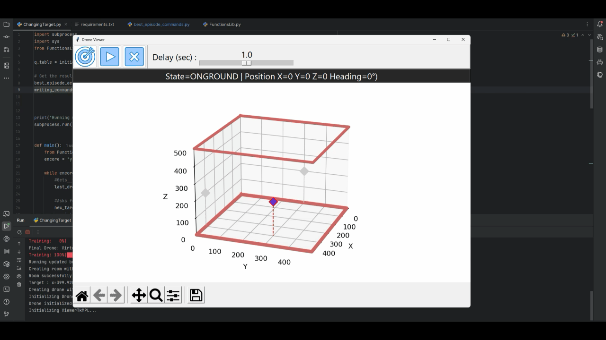

# Reinforcement Learning Navigating Drone

<div align="center">


<h3>An intelligent drone navigation system using Q-Learning to autonomously locate targets in 3D environments</h3>

[**Features**](#features) • [**Demo**](#demo) • [**Installation**](#installation) • [**Usage**](#quick-start) • [**Documentation**](#documentation)


</div>

---

## Overview

This project implements an advanced **Q-Learning algorithm** to train a virtual drone for autonomous navigation in customizable 3D environments. Originally developed as an innovative solution to a university assignment, it showcases the power of reinforcement learning in robotics applications.

For more details please read [Project Report](Dossier%20Projet%20Drone.docx)

### Key Highlights

- **Reinforcement Learning**: Implements Q-Learning with customizable hyperparameters
- **Real-time 3D Visualization**: Interactive simulation with matplotlib and tkinter
- **Dynamic Retraining**: Adapt to new targets without restarting
- **Optimized Trajectories**: Intelligent path smoothing for efficient navigation
- **Performance Monitoring**: Track training progress and replay best episodes

## Features

- **Room Simulation:** Customizable 3D room environment for drone navigation
- **Target Detection:** Intelligent algorithm to locate a target in the simulated room
- **Reinforcement Learning:** Implements Q-Learning for trajectory optimization
- **Visualization:** Real-time 3D trajectory plotting for training and performance monitoring
- **Dynamic Updates:** Allows reconfiguration of the target's location with retraining capabilities
- **Replay Mechanism:** Replays the best navigation trajectory using generated commands

## Demo

<div align="center">
<h3>Step-by-Step Simulation Process</h3>
</div>

<div align="center">
<h4>Step 1: Initial Configuration</h4>

<br><br>
When you launch <code>ChangingTarget.py</code>, you'll be prompted to configure:<br>
• Room dimensions (depth, width, height)<br>
• Target position (x, y, z coordinates)<br>
• Drone starting position<br>
• Number of training episodes<br>
• Maximum steps per episode
</div>

---

<div align="center">
<h4>Step 2: Training Process</h4>

<br><br>
The Q-Learning algorithm trains the drone through multiple episodes:<br>
• The drone explores the environment<br>
• Learns from successful and unsuccessful attempts<br>
• Updates its Q-table based on rewards<br>
• Progress bar shows training advancement
</div>

---

<div align="center">
<h4>Step 3: Best Episode Visualization</h4>
<table>
   <tr>
      <td></td>
      <td></td>
   </tr>
</table>
<br><br>
After training, the simulation automatically displays:<br>
• The most efficient path found<br>
• Smoothed trajectory commands<br>
• Target detection confirmation
</div>

---

<div align="center">
<h4>Step 4: Dynamic Target Repositioning</h4>
<table>
   <tr>
      <td></td>
      <td></td>
   </tr>
</table>
<br><br>
Without restarting the program:<br>
• Close the simulation window<br>
• Enter new target coordinates<br>
• The drone starts from its last position<br>
• Retraining adapts to the new target location
</div>

---

## Quick Start

### Prerequisites

- Python 3.8 or higher
- pip package manager
- Virtual environment (recommended)

### Installation

1. **Clone the repository**
```bash
git clone https://github.com/Warukho/Reinforcement-Learning-Navigating-Drone.git
cd Reinforcement-Learning-Navigating-Drone
```

2. **Create a virtual environment** (recommended)
```bash
python -m venv venv
source venv/bin/activate  # On Windows: venv\Scripts\activate
```

3. **Install dependencies**
```bash
pip install -r requirements.txt
```

### Basic Usage

```bash
# Run the main application
python ChangingTarget.py
```

Follow the interactive prompts as shown in the demo section above.

## Documentation

### Project Structure

```
Reinforcement_Learning_Navigating_Drone/
│
├── dronecore/              # Core drone mechanics
├── images/                 # UI assets
├── README_Data/           # Documentation assets
│
├── ChangingTarget.py      # Main application entry point
├── FunctionsLib.py        # RL algorithms & utilities
├── dronecmds.py          # Drone command interface
├── best_episode_commands.py  # Replay functionality
│
├── viewermpl.py          # Matplotlib visualizer
├── viewertk.py           # Tkinter GUI interface
├── mplext.py             # 3D plotting extensions
│
└── requirements.txt      # Project dependencies
```

### Technical Architecture

#### Q-Learning Implementation

The drone learns optimal navigation strategies through:

- **State Space**: Discretized 3D coordinates (x, y, z)
- **Action Space**: 6 directions × variable distances
- **Reward System**:
  - +1000 for reaching target
  - Proportional rewards for reducing distance
  - Penalties for inefficient movements

```python
# Q-table update formula
q_table[state][action] = old_value + α * (reward + γ * max(q_table[next_state]) - old_value)
```

#### Key Components

**Dynamic State Discretization**

The state space automatically adapts to room dimensions:
```python
state_bins = [
    np.linspace(0, room_width, round(5 + (room_width ** 0.45))),
    np.linspace(0, room_depth, round(5 + (room_depth ** 0.45))),
    np.linspace(0, room_height, round(5 + (room_height ** 0.45)))
]
```

---

<strong>
<p align="center" style="font-size: 28px; font-weight: bold; margin-bottom: 20px;">
  Trajectory Smoothing Algorithm
</p>
</strong>

<div align="center">
   
<details>
<summary>Click to see WITHOUT smoothing</summary>
<br>
<div align="center" style="background-color: 
#1e1e1e; padding: 20px; border-radius: 12px; max-width: 700px; margin: auto; box-shadow: 0 0 12px rgba(0,0,0,0.4);">
  
</div>
<br><br>
</details>

<details>
<summary>Click to see WITH smoothing</summary>
<br>
<div align="center" style="background-color: 
#1e1e1e; padding: 20px; border-radius: 12px; max-width: 700px; margin: auto; box-shadow: 0 0 12px rgba(0,0,0,0.4);">
  
</div>
<br><br>


</div>

<p align="center" style="font-size: 16px; max-width: 700px; margin: auto; line-height: 1.6;">
  <strong>Optimizes command sequences by:</strong><br>
  – Aggregating movements by direction<br>
  – Canceling opposing movements<br>
  – Prioritizing larger movements<br>
  – Chunking commands to respect maximum distance constraints
</p>


---

**Adaptive Exploration Strategy**

Balances exploration vs exploitation:
```python
# Epsilon-greedy approach with decay
epsilon = max(epsilon * epsilon_decay, epsilon_min)
```

### Hyperparameters

| Parameter | Default Value | Description |
|-----------|---------------|-------------|
| Learning Rate (α) | 0.05 | Controls how quickly the drone learns |
| Discount Factor (γ) | 0.995 | Importance of future rewards |
| Initial Exploration (ε) | 0.98 | Initial randomness in actions |
| Epsilon Decay | 0.92 | Rate of exploration reduction |
| Minimum Epsilon | 0.01 | Minimum exploration rate |   

## Advanced Usage

### Custom Training Configuration

Modify hyperparameters in `FunctionsLib.py`:
```python
# Training parameters
alpha = 0.05        # Learning rate
gamma = 0.995       # Discount factor
epsilon = 0.98      # Initial exploration rate
epsilon_decay = 0.92
epsilon_min = 0.01
```

### Programmatic Control

```python
from FunctionsLib import initialize_settings, training_loop, get_training_results

# Initialize environment
settings = initialize_settings()

# Run training
best_actions, best_trajectory = training_loop(
    env_with_viewer, 
    num_episodes=100, 
    max_steps=500
)

# Generate replay commands
writing_commands(best_actions, settings["room_x"], settings["room_y"], 
                settings["room_height"], settings["drone_x"], settings["drone_y"],
                settings["target_x"], settings["target_y"], settings["target_z"])
```

### Replay Best Episode

To replay the optimal trajectory after training:
```bash
python best_episode_commands.py
```

## License

This project is licensed under the GNU General Public License v3.0 - see the [LICENSE](LICENSE) file for details.

## Acknowledgments

### Development Team

**Axel Bouchaud--Roche**  
- Reinforcement Learning implementation
- Dynamic environment adaptation
- Q-Learning algorithm optimization
- Email: axelbouchaudroche@gmail.com
- GitHub: [AxelBcr](https://github.com/AxelBcr)

**Pierre Chauvet**  
- Core framework development
- Drone command interface
- 3D visualization system
- Email: pierre.chauvet@uco.fr
- GitHub: [pechauvet](https://github.com/pechauvet)

**Léo Bugyan**  
- Co-developpment
- Writing report
- GitHub: [zenk02](https://github.com/zenk02) 

---

<div align="center">

### Project Status: Completed

This project was developed as part of a first-year university assignment and successfully demonstrates advanced reinforcement learning concepts applied to drone navigation.

</div>
